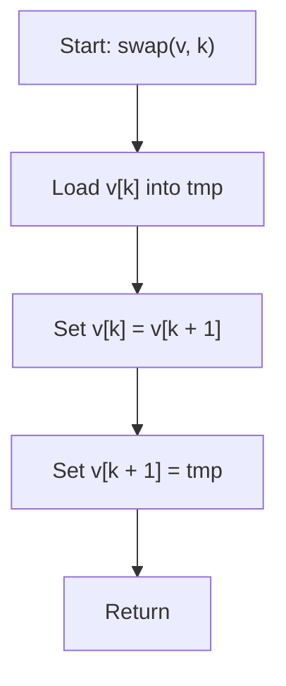
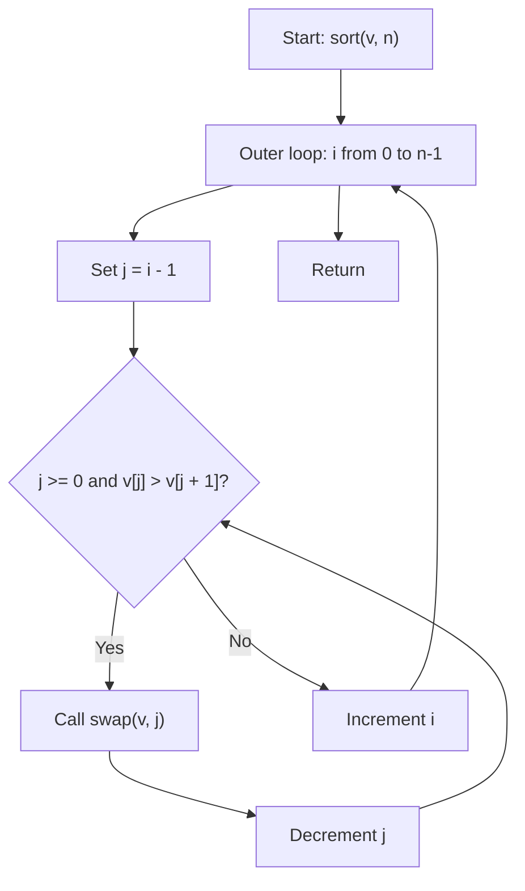

# Bubble Sort

## swap

```mermaid
flowchart TD
    A["Start: swap(v, k)"] --> B["Load v[k] into tmp"]
    B --> C["Set v[k] = v[k + 1]"]
    C --> D["Set v[k + 1] = tmp"]
    D --> E["Return"]
```

## sort

```mermaid
flowchart TD
    A["Start: sort(v, n)"] --> B["Outer loop: i from 0 to n-1"]
    B --> C["Set j = i - 1"]
    C --> D{"j >= 0 and v[j] > v[j + 1]?"}
    D -- Yes --> E["Call swap(v, j)"]
    E --> F["Decrement j"]
    F --> D
    D -- No --> G["Increment i"]
    G --> B
    B --> H["Return"]
```